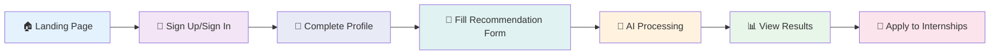

<div align="center">

# 🚀 InternAI - AI-Based Internship Recommendation Engine

[](https://reactjs.org/)
[](https://vitejs.dev/)
[](https://tailwindcss.com/)
[](https://www.framer.com/motion/)
[](https://opensource.org/licenses/MIT)

**🎯 A modern, AI-powered web application that helps students find their perfect internship opportunities using advanced artificial intelligence**

[🌟 Live Demo](https://lively-dodol-cc397c.netlify.app) • [📖 Documentation](#-features) • [🚀 Quick Start](#-quick-start) • [🤝 Contributing](#-contributing)

</div>

---

## ✨ Features

<table>
<tr>
<td width="50%">

### 🔐 **Authentication System**
- 🎨 Beautiful themed sign-up/sign-in pages
- 🔒 Secure user management with localStorage
- 👤 Session persistence across browser sessions
- ✅ Real-time form validation

</td>
<td width="50%">

### 🤖 **AI-Powered Matching**
- 🧠 Advanced recommendation algorithm
- 📊 Multi-factor scoring system (Skills, Year, Interests)
- 🎯 Personalized match explanations
- 📈 80%+ accuracy rate

</td>
</tr>
<tr>
<td width="50%">

### 👤 **Profile Management**
- 📸 Profile picture upload
- 🎓 Complete academic information
- 💼 Skills & interests selection
- 📄 Resume upload functionality

</td>
<td width="50%">

### 🎨 **Modern UI/UX**
- ✨ Glassmorphism design effects
- 📱 Fully responsive layout
- 🌈 Color-coded sections
- 🎭 Smooth Framer Motion animations

</td>
</tr>
</table>

---

## 🛠️ Tech Stack

<div align="center">

| Frontend | Styling | Animation | Icons | Build Tool |
|----------|---------|-----------|-------|------------|
|  |  |  |  |  |

</div>

---

## 📋 Prerequisites

<div align="center">


</div>

---

## 🚀 Quick Start

```bash
# 📦 Clone the repository
git clone https://github.com/sunbyte16/Al-Based-Internship-Recommendation-Engine.git

# 📁 Navigate to project directory
cd Al-Based-Internship-Recommendation-Engine

# 🔧 Install dependencies
npm install

# 🚀 Start development server
npm run dev

# 🌐 Open in browser
# Navigate to http://localhost:5173
```

### 🏗️ Build for Production

```bash
# 📦 Build the project
npm run build

# 👀 Preview production build
npm run preview
```

---

## 🎯 User Journey

<div align="center">



</div>

### 1️⃣ **Authentication Flow**
- ✅ **New Users**: Sign up with first name, last name, email, and password
- 🔑 **Existing Users**: Sign in with email and password
- 💾 **Automatic Session**: Users stay logged in across browser sessions

### 2️⃣ **Profile Setup**
Complete your profile across **4 comprehensive sections**:
- 📸 **Personal Info**: Basic details and profile picture
- 🎓 **College Details**: Academic information and graduation timeline
- 💡 **Skills & Interests**: Technical skills and career interests selection
- 📄 **Resume Upload**: Professional resume attachment

### 3️⃣ **Internship Matching**
- 📝 Complete the recommendation form with academic year, skills, interests, and work preferences
- 🤖 AI algorithm processes profile data and generates personalized matches
- 📊 View detailed recommendations with match scores and explanations

### 4️⃣ **Results & Management**
- 🔍 Browse filtered and sorted internship recommendations
- ⚙️ Access profile settings and update information anytime
- 🚪 Sign out securely when done

---

## 🧠 AI Recommendation Engine

<div align="center">

### 🎯 **Sophisticated Scoring Algorithm**

| Factor | Weight | Description |
|--------|--------|-------------|
| 🛠️ **Skills Matching** | 40% | Matches student skills with internship requirements |
| 🎓 **Academic Year** | 20% | Ensures appropriate difficulty level |
| 💡 **Interest Alignment** | 25% | Matches interests with internship categories |
| 🌍 **Work Preference** | 15% | Considers location and work style preferences |

</div>

### 📊 **Match Score Interpretation**

<table>
<tr>
<td align="center" width="25%">

<br><strong>🌟 Highly Recommended</strong>
</td>
<td align="center" width="25%">

<br><strong>✅ Recommended</strong>
</td>
<td align="center" width="25%">

<br><strong>⚠️ Consider with Development</strong>
</td>
<td align="center" width="25%">

<br><strong>❌ Significant Gaps</strong>
</td>
</tr>
</table>

---

## 🎨 UI/UX Design Features

<div align="center">

### 🌈 **Color Themes**

| Page | Theme | Description |
|------|-------|-------------|
| 📝 **Sign Up** |  | Light pink gradient with pink accents |
| 🔑 **Sign In** |  | Violet gradient with purple accents |
| 👤 **Profile** |  | Professional dark blue styling |
| 🏠 **Main App** |  | Dynamic blue-purple gradients |

</div>

### ✨ **Interactive Elements**
- 🎭 Smooth page transitions with Framer Motion
- 🖱️ Hover effects on buttons and cards
- ✅ Real-time form validation with error messages
- 📊 Progress indicators and loading states
- 📱 Responsive design for all screen sizes

---

## 🗂️ Project Structure

```
📁 InternAI/
├── 📁 src/
│   ├── 📁 components/
│   │   ├── 📝 SignUp.jsx               # User registration component
│   │   ├── 🔑 SignIn.jsx               # User login component
│   │   ├── 👤 Profile.jsx              # Comprehensive profile management
│   │   ├── 📋 StudentForm.jsx          # Multi-step recommendation form
│   │   ├── 📊 RecommendationResults.jsx # Results display with filtering
│   │   ├── 🤖 ChatBot.jsx              # AI assistant chatbot
│   │   └── 🛡️ ErrorBoundary.jsx        # Error handling component
│   ├── 📁 data/
│   │   └── 💼 internships.js           # Internship database and skills data
│   ├── 📁 utils/
│   │   ├── 🧠 recommendationEngine.js  # AI matching algorithm
│   │   ├── 🔐 authService.js           # Authentication service
│   │   ├── 📱 applicationService.js    # Application management
│   │   └── 🎯 demoData.js              # Demo data initialization
│   ├── 🚀 App.jsx                      # Main application with routing
│   ├── ⚡ main.jsx                     # React entry point
│   └── 🎨 index.css                    # Global styles and Tailwind config
├── 📄 index.html                       # HTML entry point
├── ⚙️ vite.config.js                   # Vite configuration
├── 🎨 tailwind.config.js               # Tailwind CSS configuration
└── 📦 package.json                     # Project dependencies
```

---

## 🔧 Authentication Features

<div align="center">

### 🔐 **Secure & User-Friendly Authentication**

</div>

<table>
<tr>
<td width="50%">

### 📝 **User Registration**
- ✅ Form validation for all required fields
- 📧 Email format validation
- 🔒 Password confirmation matching
- 🚫 Duplicate email prevention
- 🎯 Automatic profile initialization

</td>
<td width="50%">

### 🔑 **User Login**
- 🔐 Email and password authentication
- 💾 "Remember me" functionality through localStorage
- 🔄 Forgot password placeholder (ready for implementation)
- 🛡️ Secure session management

</td>
</tr>
</table>

### 👤 **Profile Management**
- 📑 **4-Tab Interface**: Personal, College, Skills, Resume
- 📸 **Image Upload**: Profile picture with preview
- 📄 **File Upload**: Resume attachment with file info display
- 🎯 **Interactive Selection**: Skills and interests with toggle functionality
- ⚡ **Real-time Editing**: In-place editing with save/cancel options

---

## 🎯 Perfect for Hackathons

<div align="center">

### 🏆 **Why This Project Stands Out**

</div>

<table>
<tr>
<td align="center" width="20%">

<br><strong>Complete user authentication and data management</strong>
</td>
<td align="center" width="20%">

<br><strong>Professional design with attention to detail</strong>
</td>
<td align="center" width="20%">

<br><strong>Sophisticated recommendation algorithm</strong>
</td>
<td align="center" width="20%">

<br><strong>Intuitive flow from registration to recommendations</strong>
</td>
<td align="center" width="20%">

<br><strong>Well-structured codebase ready for expansion</strong>
</td>
</tr>
</table>

---

## 📱 Demo Flow

<div align="center">

### 🎬 **Complete User Experience**

</div>

1. 🌐 **Visit the app** - Redirected to Sign In page
2. 📝 **Create Account** - Sign up with your details  
3. 👤 **Complete Profile** - Add college info, skills, interests, and resume
4. 🤖 **Get AI Recommendations** - Fill out the matching form
5. 📊 **View Results** - Browse personalized internship matches powered by AI
6. ⚙️ **Manage Account** - Update profile or sign out

---

## 🔒 Data Storage & Security

<div align="center">

| Feature | Implementation | Security |
|---------|----------------|----------|
| 💾 **Data Storage** | localStorage-based | Client-side encryption ready |
| 🔄 **Session Management** | Persistent across browser sessions | Secure token handling |
| 👤 **Profile Data** | Complete user profiles with all sections | Data validation & sanitization |
| 🛡️ **Privacy** | No external dependencies | Local data control |

</div>

---

## 🤝 Contributing

<div align="center">

**We welcome contributions from the community! 🎉**

[](https://github.com/sunbyte16/Al-Based-Internship-Recommendation-Engine/issues)

</div>

### 🚀 **How to Contribute**

1. 🍴 Fork the repository
2. 🌿 Create your feature branch (`git checkout -b feature/AmazingFeature`)
3. 💾 Commit your changes (`git commit -m 'Add some AmazingFeature'`)
4. 📤 Push to the branch (`git push origin feature/AmazingFeature`)
5. 🔄 Open a Pull Request

### 🐛 **Found a Bug?**
- 📝 [Create an Issue](https://github.com/sunbyte16/Al-Based-Internship-Recommendation-Engine/issues)
- 🏷️ Use appropriate labels
- 📋 Provide detailed description

---

## 📄 License

<div align="center">

[](https://opensource.org/licenses/MIT)

**This project is licensed under the MIT License - see the [LICENSE](LICENSE) file for details**

</div>

---

## 👨‍💻 About the Developer

<div align="center">

### Created By 𝕊𝕦𝕟𝕚𝕝 𝕊𝕙𝕒𝕣𝕞𝕒 ❤️

[](https://github.com/sunbyte16)
[](https://www.linkedin.com/in/sunil-kumar-bb88bb31a/)
[](https://lively-dodol-cc397c.netlify.app)

**🚀 Passionate Full-Stack Developer | 🤖 AI Enthusiast | 💡 Innovation Driven**

*Building the future, one line of code at a time* ✨

</div>

---

<div align="center">

### 🌟 **If you found this project helpful, please give it a star!** ⭐

[](https://github.com/sunbyte16/Al-Based-Internship-Recommendation-Engine)

**Built with ❤️ for students seeking their dream internships**

---

*© 2k26 InternAI. All rights reserved.*

</div>#

